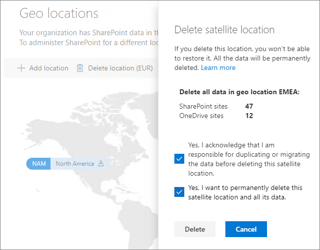

# Удаление вспомогательного расположения в Office 365 с поддержкой нескольких регионов.

Если вам больше не нужно вспомогательное расположение, можно удалить его из клиента в Центре администрирования SharePoint.

> [!WARNING]
> Все данные пользователя во вспомогательном расположении будут безвозвратно удалены. К ним относятся все содержимое OneDrive для бизнеса, сайты SharePoint, почтовые ящики Exchange, а также почтовые ящики групп Office 365. Перед удалением вспомогательного расположения необходимо перенести все данные в другое вспомогательное или центральное расположение. Это действие невозможно отменить.

Удалить вспомогательное расположение могут только глобальные администраторы.

Чтобы удалить вспомогательное расположение, выполните указанные ниже действия.

1. Откройте Центр администрирования SharePoint.

2. Перейдите на вкладку **Географические расположения**.

3. На карте щелкните геообъект, который хотите удалить.

4. Нажмите **Удалить расположение**.

5. Подтвердите удаление, установив флажки подтверждения.

6. Нажмите кнопку **Удалить**.
