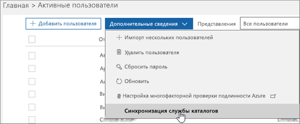

# Устранение проблем с синхронизацией службы каталогов для Office 365

С помощью синхронизации службы каталогов можно продолжать локально управлять пользователями и группами и синхронизировать добавления, удаления и изменения с облаком. Тем не менее ее настройка немного сложна и иногда бывает трудно определить причину проблемы. Мы предлагаем ресурсы, которые помогут вам выявить потенциальные проблемы и устранить их.
  
## Как узнать, что что-то пошло не так?

Первым сигналом о наличии проблемы служит вот такое сообщение, появляющееся на плитке "Состояние DirSync" в Центре администрирования Microsoft 365:
  

  
Вы также получите от Office 365 почтовое сообщение (на адрес электронной почты администратора и запасной адрес) о том, что в вашем клиенте обнаружены ошибки синхронизации службы каталогов. Подробные сведения см. в статье [Определение ошибок синхронизации службы каталогов в Office 365](identify-directory-synchronization-errors.md).
  
## Как получить средство Azure Active Directory Connect?

В [Центре администрирования Microsoft 365](https://admin.microsoft.com) перейдите к разделу ** Пользователи ** \> **Активные пользователи**. В меню **Дополнительно** выберите элемент **Синхронизация службы каталогов**. 
  

  
Следуйте [инструкциям в мастере](set-up-directory-synchronization.md), чтобы скачать Azure AD Connect. 
  
Если вы все еще используете средство синхронизации Azure Active Directory (DirSync), ознакомьтесь со статьей [Устранение ошибок установки инструмента для синхронизации Azure Active Directory и мастера настройки в Office 365](https://go.microsoft.com/fwlink/p/?LinkId=396717), чтобы узнать о требованиях к системе для установки средства, необходимых разрешениях и устранении распространенных ошибок. 
  
Чтобы перейти от средства синхронизации Azure Active Directory к Azure AD Connect, см. [инструкции по обновлению](https://go.microsoft.com/fwlink/p/?LinkId=733240).
  
## Устранение распространенных причин проблем с синхронизаций службы каталогов в Office 365

### **Синхронизированные объекты не отображаются или не обновляются в режиме онлайн. Или служба возвращает отчеты об ошибках синхронизации.**

- [Синхронизация удостоверений и устойчивость повторяющихся атрибутов](https://docs.microsoft.com/azure/active-directory/hybrid/how-to-connect-syncservice-duplicate-attribute-resiliency)

### **Я получаю оповещение в Центре администрирования. Или на мой электронный адрес приходят автоматические сообщения о том, что в последнее время синхронизация не выполнялась**
- [Устранение неполадок подключения с помощью Azure AD Connect](https://docs.microsoft.com/azure/active-directory/hybrid/tshoot-connect-connectivity)
- [Azure AD Connect: учетные записи и разрешения](https://go.microsoft.com/fwlink/p/?LinkId=820598)
- [Синхронизация Azure AD Connect: управление учетной записью службы Azure AD](https://docs.microsoft.com/azure/active-directory/hybrid/how-to-connect-azureadaccount)
- [Синхронизация каталогов с Azure Active Directory остановлена или более суток не зарегистрировано попыток синхронизации](https://support.microsoft.com/help/2882421/directory-synchronization-to-azure-active-directory-stops-or-you-re-warned-that-sync-hasn-t-registered-in-more-than-a-day)

### **Не синхронизируются пароли. Или в Центре администрирования Office 365 появляется оповещение о том, что в последнее время синхронизация паролей не выполнялась**
- [Реализация синхронизации хэшированных паролей в службе синхронизации Azure AD Connect](https://docs.microsoft.com/azure/active-directory/hybrid/how-to-connect-password-hash-synchronization)

### **Появляется оповещение о том, что превышена квота на объекты.**
- Для защиты службы используется встроенная квота на объекты. Если в каталоге слишком много объектов, которые нужно синхронизировать с Office 365, [обратитесь в службу поддержки продуктов для бизнеса](https://support.office.com/article/32a17ca7-6fa0-4870-8a8d-e25ba4ccfd4b) с просьбой увеличить квоту.

### **Мне нужно знать, какие атрибуты синхронизируются**
- Список всех атрибутов, которые синхронизируются между локальной средой и облаком, можно найти [здесь](https://go.microsoft.com/fwlink/p/?LinkId=396719).

### **Не удается управлять объектами, синхронизированными с облаком, и удалять их**
- Вы готовы управлять объектами только в облаке? Или вы удалили объект локально, но он все еще существует в облаке? Ознакомьтесь с этой статьей [Устранение ошибок синхронизации во время синхронизации](https://go.microsoft.com/fwlink/p/?linkid=842044) и [справочной статьей](https://go.microsoft.com/fwlink/p/?LinkId=396720), чтобы получить инструкции по устранению этих проблем.

### **Появляется сообщение об ошибке, в котором говорится, что в компании превышено количество объектов, которые можно синхронизировать.**
- Подробнее об этой проблеме вы можете узнать [здесь](https://go.microsoft.com/fwlink/p/?LinkId=396721).
   
## Другие ресурсы

- [Сценарий для устранения повторяющихся имен участников-пользователей](https://go.microsoft.com/fwlink/p/?LinkId=396725)
    
- [Сведения о подготовке немаршрутизируемого домена (например, .local) для синхронизации службы каталогов](prepare-a-non-routable-domain-for-directory-synchronization.md)
    
- [Сценарий для подсчета общего числа синхронизированных объектов](https://go.microsoft.com/fwlink/p/?LinkId=396726)
    
- [Устранение неполадок AD FS 2.0](https://go.microsoft.com/fwlink/p/?LinkId=396727)
    
- [Использование PowerShell для исправления пустых атрибутов DisplayName для групп, поддерживающих почту](https://go.microsoft.com/fwlink/p/?LinkId=396728)
    
- [Использование PowerShell для устранения повторяющихся имен участников-пользователей](https://go.microsoft.com/fwlink/p/?LinkId=396730)
    
- [Использование PowerShell для устранения повторяющихся адресов электронной почты](https://go.microsoft.com/fwlink/p/?LinkId=396731)
    
## Средства диагностики

Средство [IDFix](prepare-directory-attributes-for-synch-with-idfix.md) используется для обнаружения и исправления объектов удостоверений и их атрибутов в локальной среде Active Directory при подготовке к переходу на Office 365. Средство IDFix предназначено для администраторов Active Directory, отвечающих за синхронизацию службы каталогов со службой Office 365. 

[Скачайте средство IDFix](https://go.microsoft.com/fwlink/p/?LinkId=396718) из Центра загрузки Майкрософт.