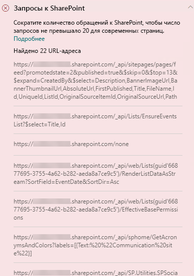

# Оптимизация вызовов на современных и классических страницах сайтов публикации SharePoint Online

Современные и классические страницы сайтов публикации SharePoint Online содержат ссылки, загружающие данные (или отправляющие вызовы) из компонентов SharePoint и CDN. Чем больше вызовов выполняет страница, тем дольше страница загружается. Это называется **задержкой, распознаваемой конечным пользователем,** или **EUPL**.

С помощью этой статьи вы узнаете, как определить число и влияние вызовов на внешние конечные точки с современных и классических страниц сайтов публикации и как ограничить их влияние на задержку, распознаваемую конечным пользователем.

>[!NOTE]
>Дополнительные сведения о производительности на современных порталах SharePoint Online см. в статье [Производительность в современном интерфейсе SharePoint](https://docs.microsoft.com/ru-RU/sharepoint/modern-experience-performance).

## Использование средства диагностики страниц SharePoint для анализа вызовов страниц

Средство **Диагностика страниц SharePoint** — это браузерное расширение для Chrome и [Microsoft Edge версии 77 или более поздней](https://www.microsoftedgeinsider.com/en-us/download?form=MI13E8&OCID=MI13E8), которое можно использовать для анализа современных и классических страниц сайтов публикации SharePoint. Это средство предоставляет отчет о каждой проанализированной странице, показывающий, как она работает при заданных критериях производительности. Чтобы установить и изучить средство диагностики страниц SharePoint, ознакомьтесь со статьей [Использование средства диагностики страниц SharePoint Online](page-diagnostics-for-spo.md).

При анализе страницы сайта SharePoint с помощью средства диагностики страниц SharePoint вы можете просматривать сведения о внешних вызовах в результатах **Запросы к SharePoint** в панели _Диагностические тесты_. Строка будет выделена зеленым цветом, если страница сайта содержит меньше вызовов, чем установленное базовое число, и красным цветом, если количество вызовов превышает базовое число. Базовое число отличается для современных и классических страниц, так как классические страницы сайтов используют протокол HTTP 1.1, а современные страницы — HTTP 2.0:

- Современные страницы сайтов не должны содержать более **25** вызовов
- Классические страницы публикации не должны содержать более **6** вызовов

Возможные результаты:

- **Внимание!** (красный цвет). На странице превышено базовое число вызовов
- **Действия не требуются** (зеленый цвет). Количество вызовов на странице не превышает базовое число

Если результат **Запросы к SharePoint** отображается в разделе **Внимание!**, вы можете щелкнуть его, чтобы просмотреть подробные сведения, включая общее число вызовов на странице и список URL-адресов.

## Исправление проблем с производительностью, связанных со слишком большим числом вызовов на странице

Если страница содержит слишком много вызовов, можно использовать список URL-адресов в результатах **Запросы к SharePoint**, чтобы определить, являются ли они повторными вызовами, вызовами, требующими пакетной обработки, или вызовами, возвращающими данные, которые следует кэшировать.

**Пакетная обработка вызовов REST** может снизить нагрузку при работе. Дополнительные сведения о пакетной обработке вызовов API см. в статье [Отправка пакетных запросов с использованием REST API](https://docs.microsoft.com/ru-RU/sharepoint/dev/sp-add-ins/make-batch-requests-with-the-rest-apis).

**Использование кэша** для хранения результатов вызова API может повысить производительность подготовленного запроса, разрешая клиенту использовать кэшированные данные вместо создания дополнительного вызова для каждой последующей загрузки страницы. Это решение можно использовать различными способами в зависимости от требований организации. Как правило, если данные одинаковы для всех пользователей, использование службы кэширования среднего уровня, например [кэша _Azure Redis_](https://azure.microsoft.com/ru-RU/services/cache/), является отличным способом значительно сократить трафик API на сайте, так как пользователи будут запрашивать данные из службы кэширования, а не напрямую из SharePoint Online. Единственными обязательными вызовами SharePoint Online будут обновления кэша среднего уровня. Если данные для отдельных пользователей отличаются, возможно, наилучшим решением будет реализовать кэширование на стороне клиента, например с помощью хранилища LocalStorage или даже файлов cookie. Это позволит сократить количество вызовов, устранив последующие запросы, выполняемые одним пользователем, пока существует кэш, но это будет менее эффективно, чем специальная служба кэширования. Служба PnP позволяет использовать хранилище LocalStorage с небольшой доработкой.

Перед внесением изменений в страницы для исправления проблем с производительностью запомните время загрузки страницы в результатах анализа. Снова запустите средство после внесения изменений, чтобы узнать, соответствует ли новый результат базовому стандарту, и проверить, сократилось ли время загрузки.

>[!NOTE]
>Время загрузки страницы зависит от множества факторов, например от загрузки сети, времени суток и других переменных условий. Следует несколько раз проверить время загрузки страницы до и после внесения изменений, чтобы получить среднестатистические данные.

## Статьи по теме

[Настройка производительности SharePoint Online](tune-sharepoint-online-performance.md)

[Настройка производительности Office 365](tune-office-365-performance.md)

[Производительность в современном интерфейсе SharePoint](https://docs.microsoft.com/sharepoint/modern-experience-performance)

[Сети доставки содержимого](content-delivery-networks.md)

[Использование сети доставки содержимого Office 365 с SharePoint Online](use-office-365-cdn-with-spo.md)
