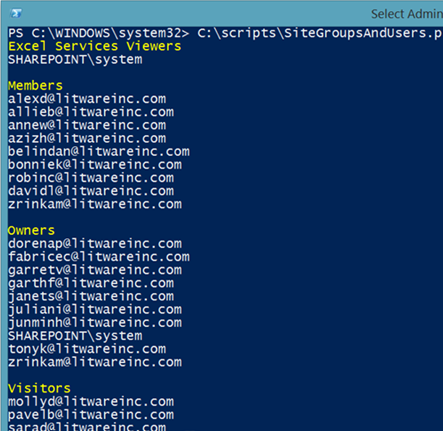

# <a name="manage-sharepoint-online-site-groups-with-office-365-powershell"></a>Управление группами сайтов SharePoint Online с помощью Office 365 PowerShell

 **Сводка:** Использование Office 365 PowerShell для управления SharePoint Online группы сайтов.
  
Несмотря на то, что можно использовать Центр администрирования Office 365, можно также использовать Office 365 PowerShell для управления SharePoint Online групп сайта.

## <a name="before-you-begin"></a>Перед началом работы

Процедуры, описанные в этой статье требуется подключение к SharePoint Online. Сведения содержатся в разделе [подключение к SharePoint Online PowerShell](https://docs.microsoft.com/en-us/powershell/sharepoint/sharepoint-online/connect-sharepoint-online?view=sharepoint-ps).

## <a name="view-sharepoint-online-with-office-365-powershell"></a>Просмотр SharePoint Online с помощью Office 365 PowerShell

Центр администрирования SharePoint Online имеет некоторые простые в использовании методы для управления группами сайтов. Предположим, например, чтобы посмотреть на группы и участники групп, `https://litwareinc.sharepoint.com/sites/finance` сайта. Вот что необходимо сделать, чтобы:

1. В центре администрирования Office 365 щелкните **ресурсы** > **сайтов**и затем щелкните URL-адрес сайта.
2. В диалоговом окне Семейство веб-сайтов выберите **Перейти на сайт**.
3. На странице сайта щелкните значок **Параметры** (в верхнем правом углу страницы) и нажмите кнопку **Параметры сайта**.<br/>
<br/>
4. На странице "Параметры узла" щелкните **разрешения сайтов** в разделе **пользователи и разрешения**.

И затем повторить процесс для следующего сайта, который необходимо просмотреть.

Чтобы получить список групп с помощью Office 365 PowerShell, используйте следующий набор команд:

```
$siteURL = "https://litwareinc.sharepoint.com/sites/finance"
$x = Get-SPOSiteGroup -Site $siteURL
foreach ($y in $x)
    {
        Write-Host $y.Title -ForegroundColor "Yellow"
        Get-SPOSiteGroup -Site $siteURL -Group $y.Title | Select-Object -ExpandProperty Users
        Write-Host
    }
```

Для выполнения этой команды в командной консоли SharePoint Online двумя способами:

- Скопируйте команд в "Блокнот" (или другом текстовом редакторе), измените значение переменной **$siteURL** , выберите команды и вставьте их в командной консоли SharePoint Online. В этом случае PowerShell будет останавливаться на **>>** строки. Нажмите клавишу ВВОД, чтобы выполнить команду **foreach** .<br/>
- Скопируйте команд в "Блокнот" (или другом текстовом редакторе), измените значение переменной **$siteURL** и затем сохраните этот текстовый файл с именем и расширение ".ps1" в соответствующие папки. Затем выполните скрипт в командной консоли SharePoint Online, указав его путь и имя файла. Ниже приведен пример команды.

```
C:\Scripts\SiteGroupsAndUsers.ps1
```

В обоих случаях должно отобразиться что-то вроде этого:



Далее представлены все группы, которые были созданы для сайта `https://litwareinc.sharepoint.com/sites/finance`и для всех пользователей, назначенных этим группам. Имена групп — желтого цвета, которые помогут вам имена другая группа от их участников.

Другой пример: Вот набор команд, содержит список групп и всех членство в группах, для всех сайтов SharePoint Online.

```
$x = Get-SPOSite
foreach ($y in $x)
    {
        Write-Host $y.Url -ForegroundColor "Yellow"
        $z = Get-SPOSiteGroup -Site $y.Url
        foreach ($a in $z)
            {
                 $b = Get-SPOSiteGroup -Site $y.Url -Group $a.Title 
                 Write-Host $b.Title -ForegroundColor "Cyan"
                 $b | Select-Object -ExpandProperty Users
                 Write-Host
            }
    }
```
    
## <a name="see-also"></a>См. также

[Подключение к PowerShell в SharePoint Online](https://docs.microsoft.com/powershell/sharepoint/sharepoint-online/connect-sharepoint-online?view=sharepoint-ps)

[Создание сайтов и добавление пользователей в SharePoint Online с помощью Office 365 PowerShell](create-sharepoint-sites-and-add-users-with-powershell.md)

[Управление пользователями и группами SharePoint Online с помощью Office 365 PowerShell](manage-sharepoint-users-and-groups-with-powershell.md) .

[Управление Office 365 с помощью PowerShell Office 365](manage-office-365-with-office-365-powershell.md)
  
[Начало работы с Office 365 PowerShell](getting-started-with-office-365-powershell.md)

